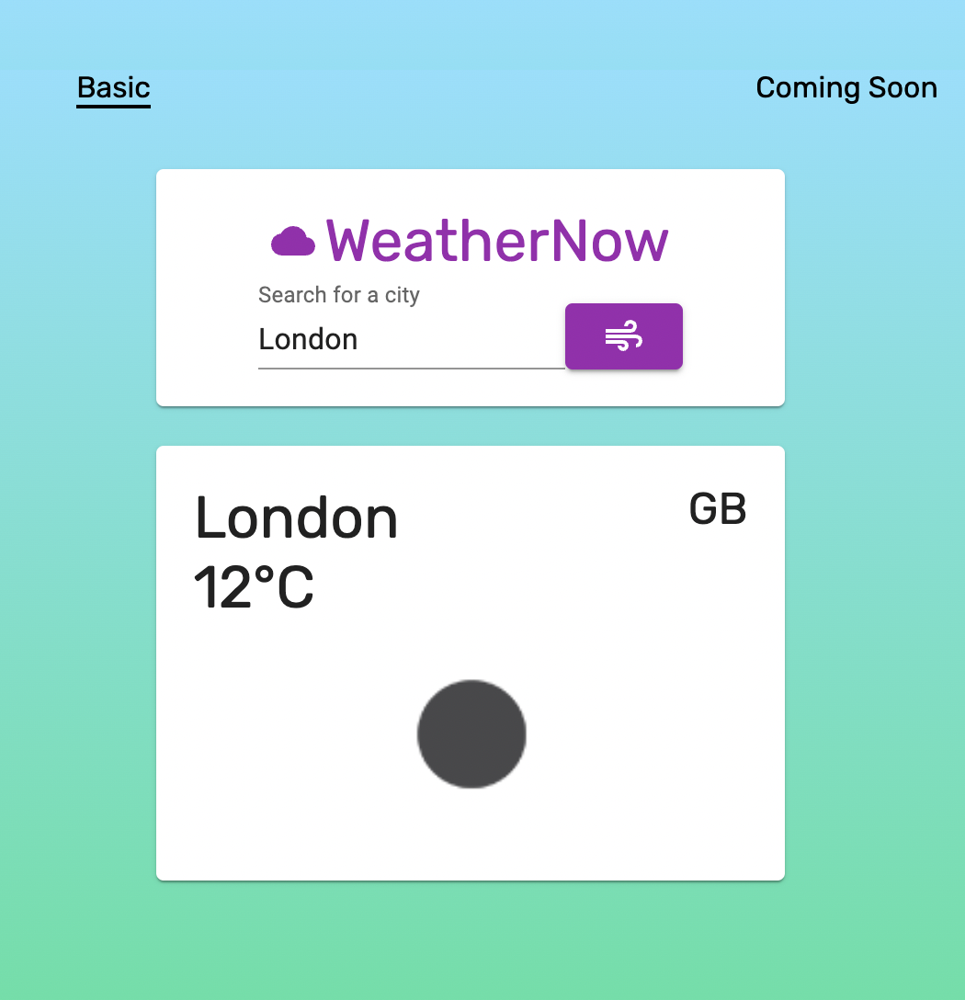

# WeatherNow Weather App with React, Redux, and API from OpenWeather

*WeatherNow is a basic Weahter App that takes a city name (City, State, Country when applicable) and fethces current data from OpenWeather. It then displays basic information and an icon to represent the weather for a given city. This was my first exercise of using an API by myself and not for a class, and is fairly basic. However, my aim in the future is add further integration of Spotify and Amazon APIs, as well as Google Maps, to allow for planning of driving routes. It is currently deployed as WeatherNow on  Netlify, though I hope to integrate it in the future as a Mobility/Driving-branded application.*

[deployed url](http://url-if-deployed-here)

## What Worked Well
I am proud of the end result, as I overcame the challenge of creating my first personal use of an API. I was able to do this in part with guidance from https://webdesign.tutsplus.com/tutorials/build-a-simple-weather-app-with-vanilla-javascript--cms-33893, though I ultimately decided to challenge myself to build a React and Redux application more in-line with my current skillsets.

## What Didn't
Initially, the use of Redux and the weather-fetching actions proved rather difficult. However, I ultimately was able to sort out the details of how to parse the information from OpenWeather (and fetch the icons!).

## Screenshots

Here is a sample of WeatherNow fetching some data about conditions in London!

